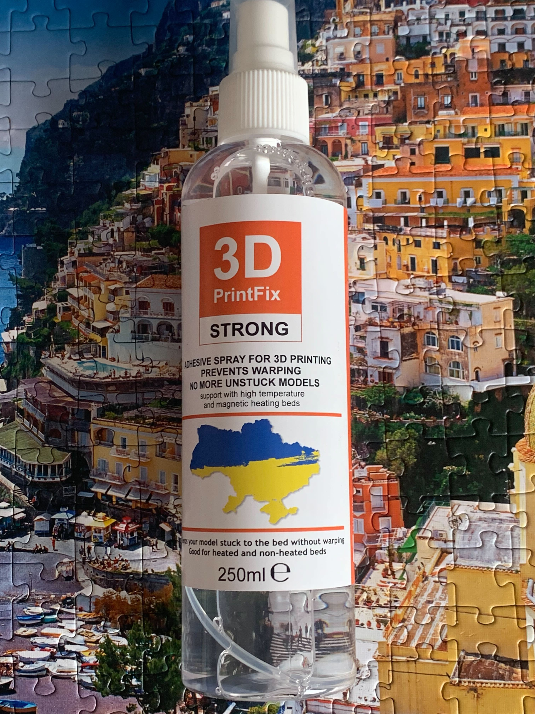
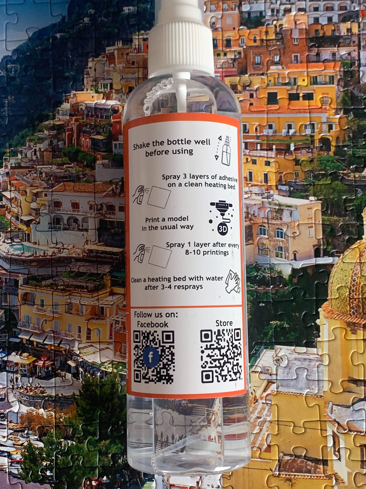

# Bed Adhesion

First and several consequantive prints went well. But then each print got worse. And here I learned a new term - bed adhesion.

Once starting googling how to get the first layer stick to the bed I quickly realized it's actually could be a huge problem in 3D printing. Different bed surfaces, different filaments, different hotend temperatures, different bed temperatures, printing speed, etc - all of this can affect the bed adhesion.

First of all the clean and leveled bed is a must have for the good bed adhesion - but only this didn't help me. Then I learned we can use some means to improve the bed adhesion. I tried the glue stick - but still no luck.

What really helped me is a 3D adhesive spray - you spray several layers of it on the clean bed and it should be enough for up to 5-8 prints without any issues of sticking the initial layer to the bed. I bought the following one (I assume it's available only in Ukraine, but there are a lot of different sprays available all over the world):

