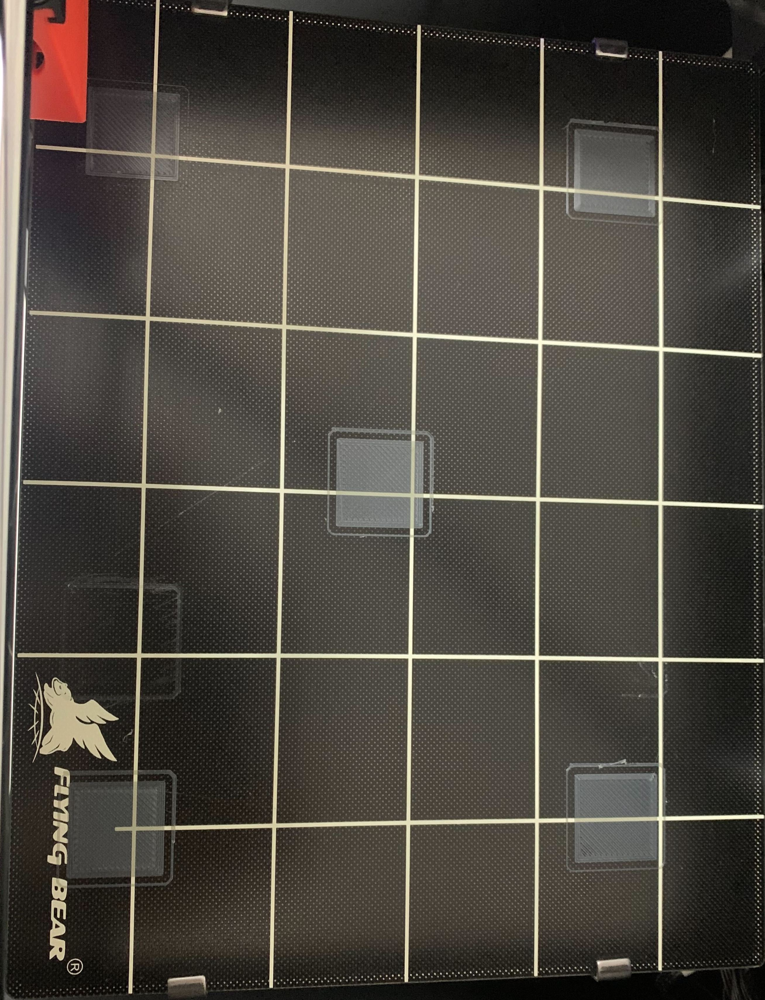
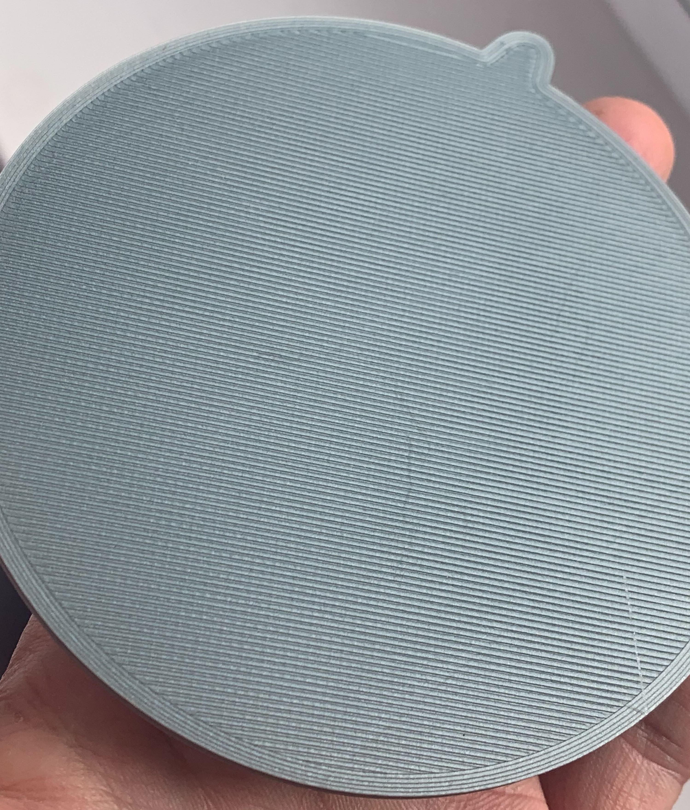

# Bed Leveling

## Stock firmware

Using the stock firmware you have an only option of using the available bed leveling routine by checking corners - everything is pretty much explained in the user manual coming together with the printer. Basically, the flow of actions is the following:

1. Preheat the bed to the temperature which will be used at printing (this means, if you're going to change the type of the filament which will require different bed temperature, the leveling routine must be redone using the new bed temperature)
2. Run bed leveling routine
3. Home all axes
4. Repeat 2-3 several times for better results

Also, we can try printing a special bed leveling squares (for instance, [this](https://www.thingiverse.com/thing:4691580)) and adjust corners on the fly - this might get a more precise bed leveling.

## Marlin firmware

When using the Marlin firmware one additional option becomes available for us - mesh bed leveling. There are a lot of information about it over the Internet - [this](https://all3dp.com/2/mesh-bed-leveling-all-you-need-to-know/), [this](https://marlinfw.org/docs/gcode/G029-mbl.html), etc.

The key point is the **mesh-based leveling compensates for the shape of the bed** - that's why it's pretty desired to use. Also, it's worth to mention that we anyway need to level corners before measuring the shape of the bed.

Let's go through the steps to level the bed using the mesh-based leveling:

1. Preheat the bed
2. Level bed corners n-times with running the auto-home in between
3. Print calibration squares to ensure bed leveling is even. Adjust corners' screws while squares are being printed. This also might take several rounds to go.
4. Run mesh bed leveling. Again run it several times. Don't forget to save settings in the EEPROM.
5. Configure the printer's start gcode to use the mesh parameters during the printing

## Results

After successfully executing all bed leveling steps the calibration squares should be evenly printed all over the printing surface:

And the initial layer of the printed part is quite good:

