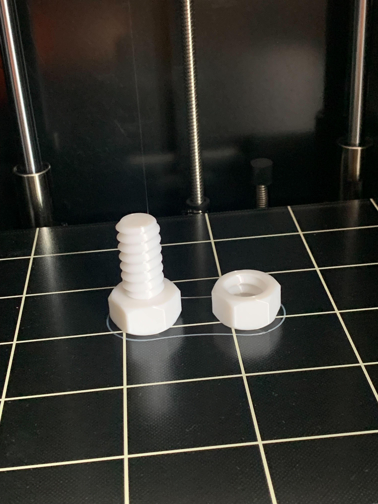
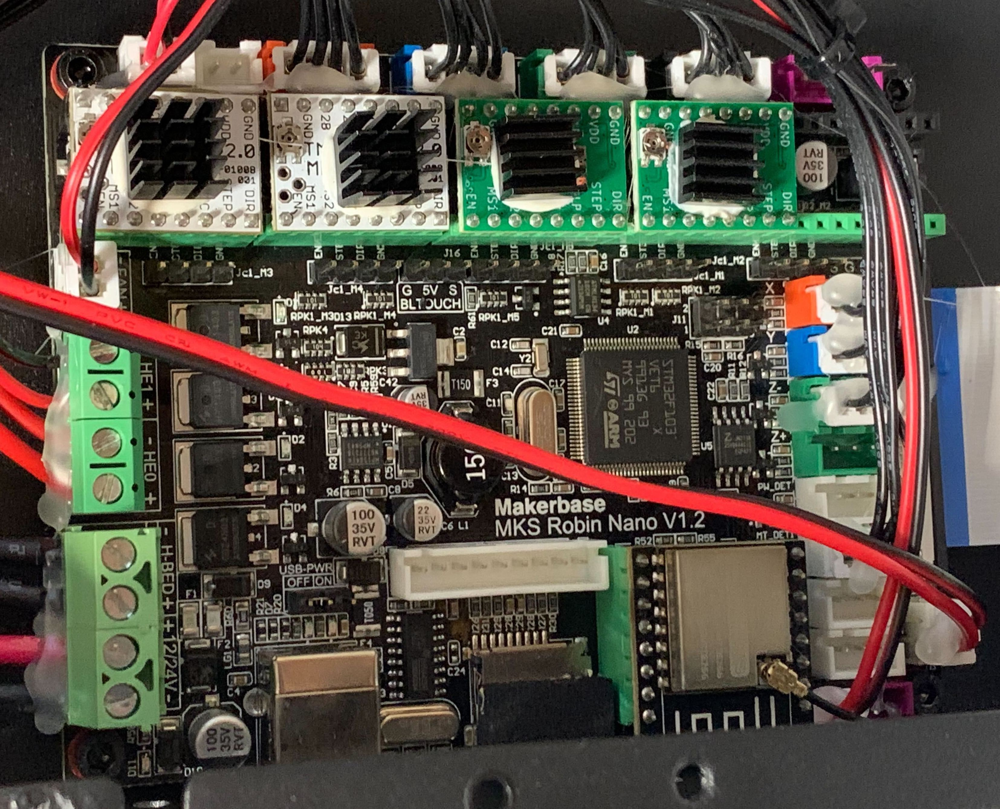
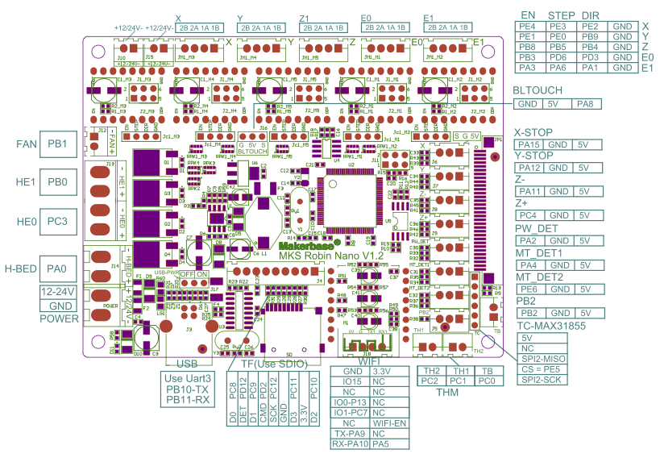
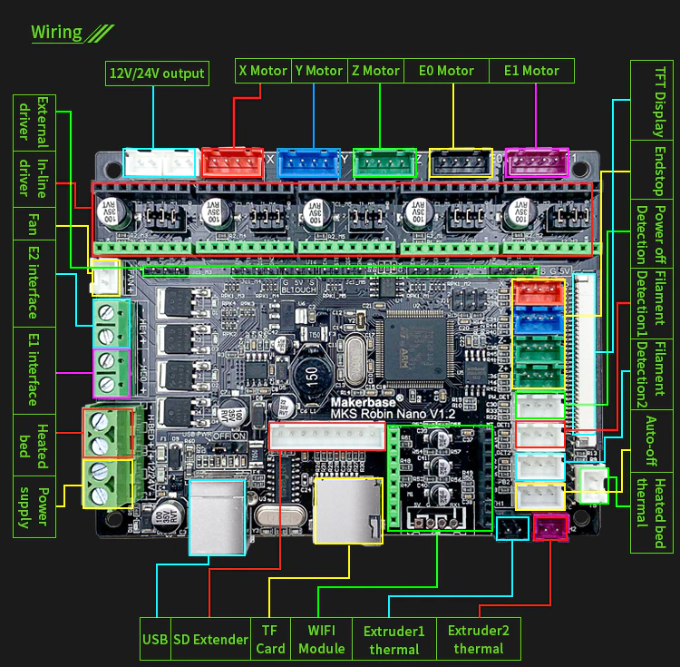

# Flying Bear Ghost 5 Usage Experience

As of now I'm an owner of the Flying Bear Ghost 5 3D printer and here I'd like to share all my findings about this printer - based on own experience as well as any resouces found over the Internet.

First of all - my first ever 3D print :tada:

## General Information

### Hardware

My copy of this printer is based on the following hardware:

- Main board: MKS Robin Nano v1.2 with STM32F103VE6
- Stepper motor drivers: 2xTCM2208 v2.0(X + Y), 2xA4988 (Z + extruder)
- Stepper motors:
  - X: 42HY40-1.8-31.5B
  - Y: 42HY47-2-24
  - Z: 42HY47-2-12
  - E0: 42HY40-1.8-31.5B

Here is how the mainboard looked right after the purchase:

### Mainboard

The pinout of the MKS Robin Nano v1.2 board is presented below in two variants:

## Calibrations

- [Bed Adhesion](BedAdhesion.md)

## Improvements

TBA

## Useful resources

- [Flying Bear Ghost Club](https://flyingbearghost.com/en/)
- [Flying Bear Ghost Club github](https://github.com/flyingbear-club-ita)
- [Teaching Tech 3D Printer Site](https://teachingtechyt.github.io/index.html)
- [Marlin for Ghost 4S/5](https://github.com/Sergey1560/Marlin_FB4S)
- [Official Marlin firmware website](https://marlinfw.org/)
- [Marlin sources](https://github.com/MarlinFirmware/Marlin)
- [Thingiverse](https://www.thingiverse.com/)
- [Cluts3D](https://cults3d.com/en)
