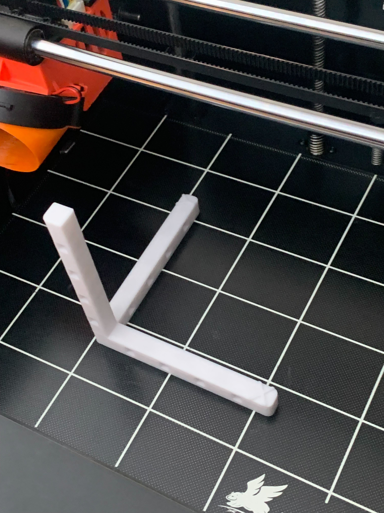

# Steps Per mm Calibration

The marlin firmware comes with the following steps/mm configuration:

- X: 80 steps/mm
- Y: 80 steps/mm
- Z: 400 steps/mm
- E: 400 steps/mm


But these numbers be a bit different per each particular copy of the printer.
Hence, I decided to spend time and calibrate all the steps/mm values to achieve
better dimensional accuracy.

## Calibration approach

The approach is pretty simple - we need to compare actual measurements with
what was expected and calculate new steps/mm value using the following formula:

```
new steps = (current steps * expected dimention value) / actual dimention value
```

## Extruder calibration

First of all, we need to calibrate the extruder to be sure the amount of the
pushed filament is accurate.

There are a lot of
[videos](https://www.youtube.com/results?search_query=extruder+calibration)
over the Youtube describing the calibration process. I'll just present numbers
and calculations.

### Round 1

```
Initial steps/mm = 400
Control distance = 100 mm
Expected distance = 90 mm

Actual offset = 13.5mm
Actual distance = 86.5mm

new steps = (400 * 90) / 86.5 = 416.19 steps/mm
```

I set the given value and decided to make another round.

### Round 2


```
Initial steps/mm = 416.19
Control distance = 100 mm
Expected distance = 90 mm

Actual offset = 10.78mm
Actual distance = 89.22mm

new steps = (416.19 * 90) / 89.22 = 419.83 steps/mm
```

I set the new steps/mm value for the extruder motor and decided it should be
good enough to just stop calibrating and simply go with that value.

## Axes calibration

For the axes calibration we need to print some part and use measured dimentions
as actual values. I used tips from
[this](https://www.youtube.com/watch?v=lYmFXrmC5p0&ab_channel=Collect3D) video
to print the 100x100x100 [calibration
print](https://www.thingiverse.com/thing:5020524) instead of 20mm cube. That's what I've got:



I was a little surprised once I measured all the dimentions.

### X axis

```
Initial steps = 80 steps/mm
Expected size = 100mm
Actual size = 100.19mm

new steps = (80 * 100) / 100.19 = 79.85 steps/mm
```

### Y axis

```
Initial steps = 80 steps/mm
Expected size = 100mm
Actual size = 100mm

new steps = (80 * 100) / 100 = 80 steps/mm
```

### Z axis

```
Initial steps = 400 steps/mm
Expected size = 100mm
Actual size = 100.03mm

new steps = (400 * 100) / 100.03 = 399.88 steps/mm
```

### Conclusion

It turned out all the dimensions are pretty well aligned with the expected
values, so it might be even not worth making some adjustments. Still, anyway, I
adjusted only X-axis steps/mm - other both values are good enough to leave them
as is.
