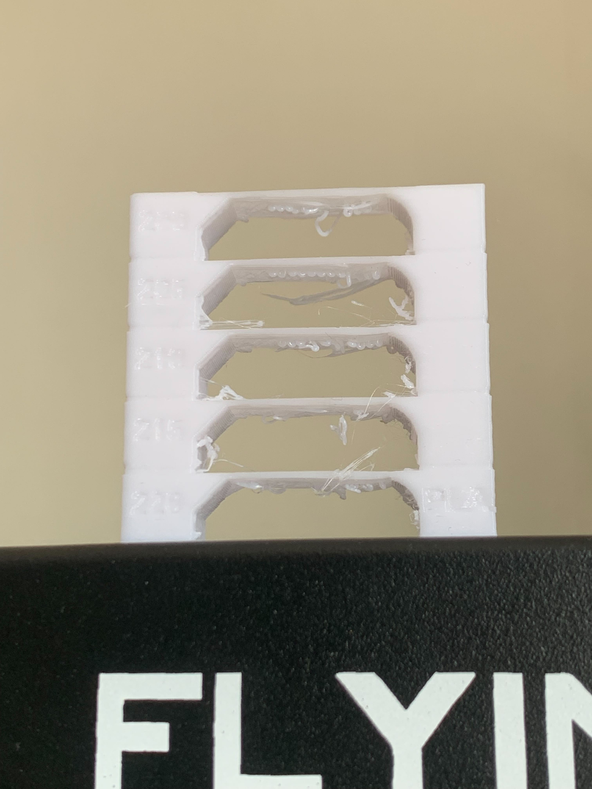
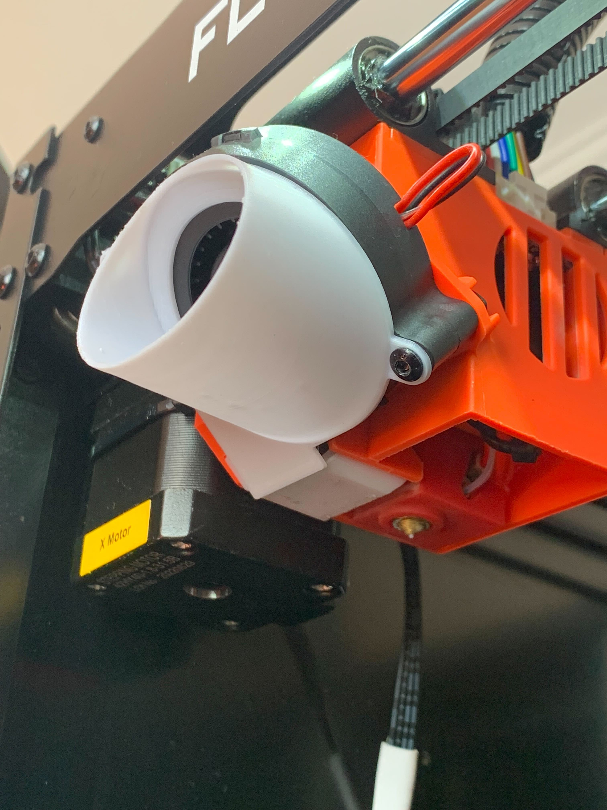
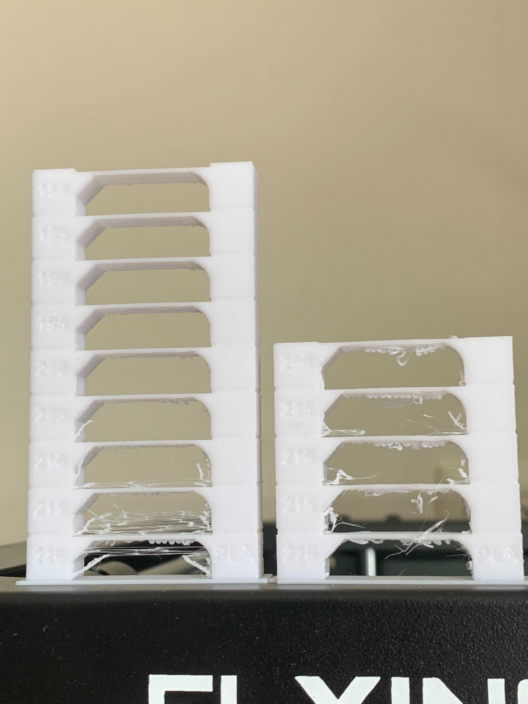

# Cooling

When I heard another FB Ghost 5 owner told somewhere in the Internet that stock
cooling isn't so good I didn't understand why until I decided to calibrate the
temperature and saw this:

The tower wasn't fully completed because I stopped printing at the temperature
200 degrees Celcius - I used this temperature for printing before running this
calibration and my expectation was that at this temperature the temp tower
should be quite good. But in reality, it was awful - the bridge was sagging
meaning something was wrong. I started seeking over the Internet for any tips
and the one was related to the cooling - most likely it wasn't enough. I
decided to check this out by replacing the stock cooler with another one bought
at the local electronics store. Also, I printed several parts installed on the cooler:

- [the nose](https://www.thingiverse.com/thing:4917311) - to direct the cold air exactly where it's needed
- [the shield](https://www.thingiverse.com/thing:4931472) - to avoid sucking the hot air from the bed

After all the modifications the cooler looks like this:

After trying to run the same temp calibration tower the result was quite pleasant:

Even at the temperature of 210 degrees the bridge became pretty much
acceptable although we can observe a definitely signs of filament oozing
meaning this temperature is too high for the printing.
