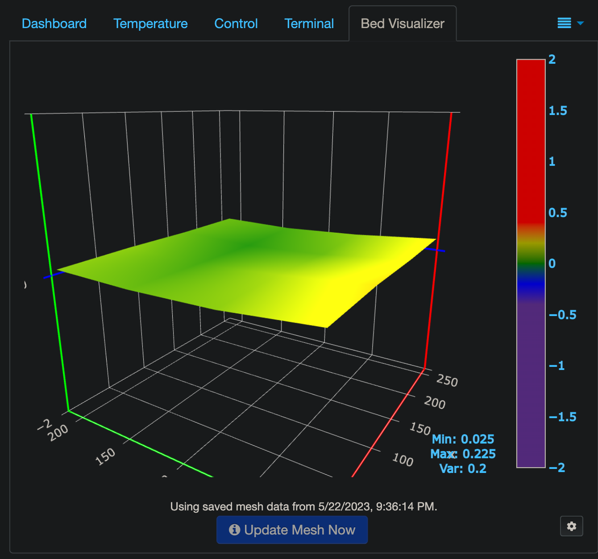

# OctoPrint

I decided to improve the control&monitoring of the 3D printing process by
introducing the [OctoPrint](https://octoprint.org/) into my setup. As for the
platform to run the OctoPrint instance I use the Orange Pi Zero 2 -
[here](https://www.obico.io/docs/user-guides/install-octoprint-orange-pi-zero-2-kit/#2-install-the-heat-sink-on-the-orange-pi-zero-2)
is a quite comprehensive guide how to setup the OctoPrint on it.

As for the remote monitoring there are the next options which I personally tried:

- [OctoPod for
  OctoPrint](https://apps.apple.com/us/app/octopod-for-octoprint/id1412557625) - it's
the native iOS app which connects to the OctoPrint (you need to install
  the [OctoPrint plugin](https://plugins.octoprint.org/plugins/octopod/) as
well). But your phone should be connected to the same network as the OctoPrint
instance does - hence, you can monitor your printing process only being at
home. Probably, this can be fixed by exposing your OctoPrint to the Internet or
configuring the OpenVPN server, so you can connect to it and have an access to
the local resources at your home.
- [obico.io](https://www.obico.io/) - the online service which can connect to
  the OctoPrint instance over the Internet, so you can monitor your printing
process from anywhere, just the Internet connection is required. On the
OctoPrint instance side you need to install the [Obico
plugin](https://plugins.octoprint.org/plugins/obico/).

While the OctoPod worked well for me, but having an ability to monitor the
printing process when I'm not at home is crucial for me, so I switched to using
the obico.io.

## Plugins

### [Bed Visualizer](https://github.com/jneilliii/OctoPrint-BedLevelVisualizer)

> This plugin visualises the output from various firmware that support bed mesh leveling.

In order to let this plugin to show the bed levels chart I put this gcode into the plugin's settings:

```gcode
G28       ; home all axes
M155 S30  ; reduce temperature reporting rate to reduce output pollution
@BEDLEVELVISUALIZER
M117 Loading existing mesh data ; send message to printer display
M420 S1 V; Load existing mesh
M155 S3  ; restore temperature reporting rate
M117 Visualized; update display
```

Once done that the plugin shows the bed levels as a 3D chart:


