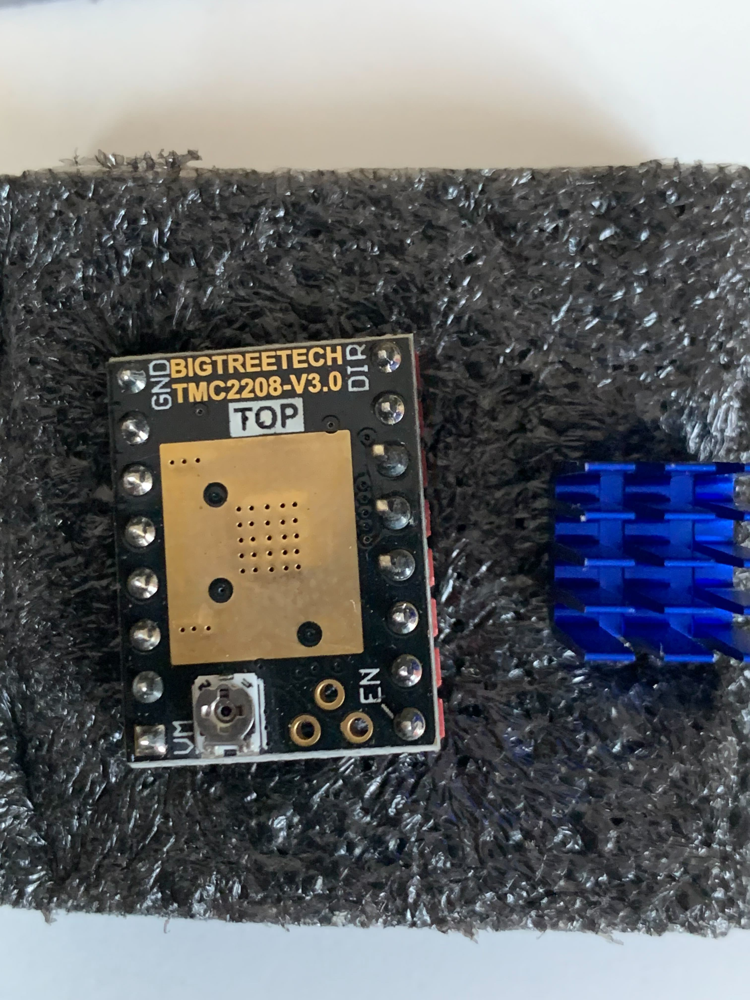
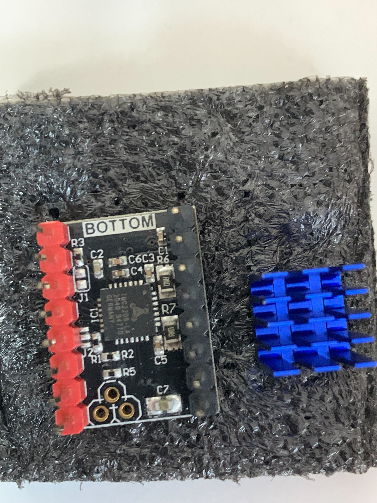
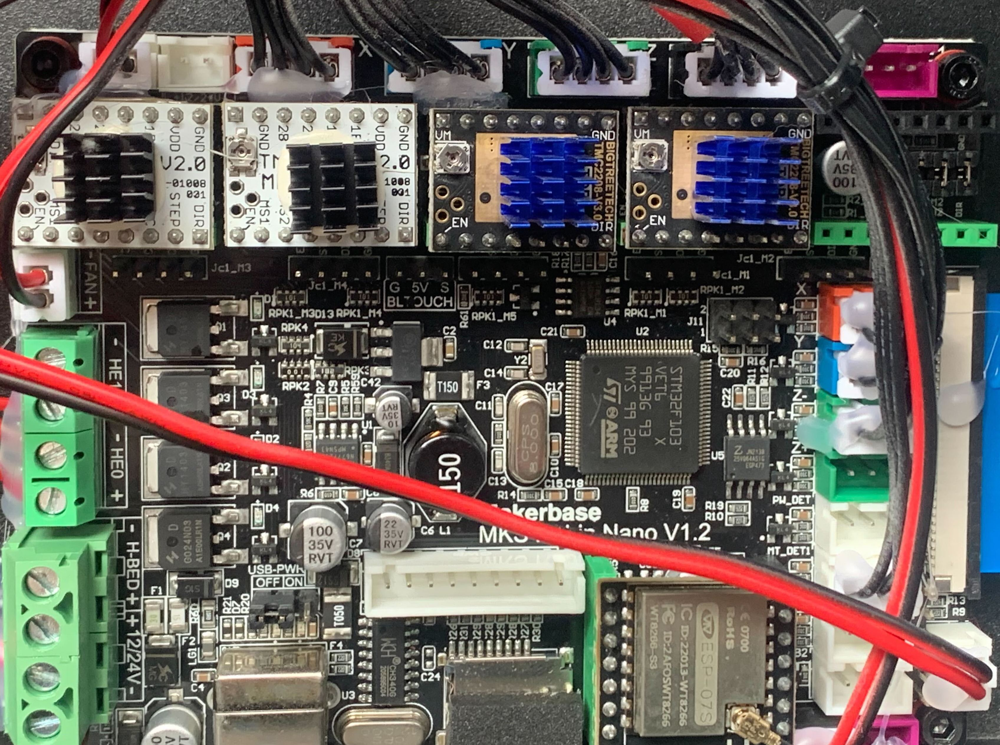

# Install Silent Motor Drivers

In the 3D printer we have 4 stepper motors and each of them needs the driver to
operate on it. In the stock version of the FB Ghost 5 printer (at least in my
copy) only 2 drivers are the `silent` ones - TMC2208 - for axes X and Y. As for
other 2 stepper motor - axis Z and the extruder - A4988 drivers are installed.
Despite working good, that drivers are quite noisy, making a nasty beep sound.

In order to make the printer silent I decided to replace stock A4988 drivers
with a pair of the silent TMC2208 ones.

### What we need?

- buy a pair of TMC2208 stepper motor drivers
- istall them on the main board instead of the A4988 ones
- set the correct Vref

### Let's make the printer silent!

In the local electronics store I bought the next drivers:




The pinout of both A4988 & TMC2208 drivers is the same, so basically what we
need to do is just eject A4988 drivers and install TMC2208 on their place.
Right after installation of the new drivers we need to adjust the Vref. Each
driver has its own formula of calculating the Vref value:

- A4988: `Vref = I * 8 * Rsense`
- TMC2208: `Vref = Irms * (2.5 / 1.77)` where `Irms = I / √2`

In order to calculate the proper Vref for the TMC2208 drivers we have to know
the `I` of the motors. But we can find it by measuring the Vref set for the
A4988 drivers and looking at the driver shield itself to find the Rsense value
and use the following formula to calculate the `I`:

`I = Vref / (8 * Rsense)`

Once knowing the current value for each motor, we can calculate the `Irms` and
finally the `Vref` for the TMC2208 drivers.

#### Z motor

```
Vrefa4988 = 0.74V
Rsense = 0.1 Ohm

I = Vref / (8 * Rsense) = 0.925 A
Irms = I / √2 = 0.66 A

Vreftmc2208 = Irms * (2.5 / 1.77) = 0.932 V
```

#### E0 motor

```
Vrefa4988 = 0.94V
Rsense = 0.1 Ohm

I = Vref / (8 * Rsense) = 1.175 A
Irms = I / √2 = 0.83 A

Vreftmc2208 = Irms * (2.5 / 1.77) = 1.177 V
```

__‼️ CAUTION:__ disconnect motors from drivers when setting the Vref!

The final view of the mainboard with new drivers:



### Final steps

Once done all of the described, all movements are finally silent! But the
rotating direction of both Z & extruder motors is inverted now. In order to fix
the rotation we have several options:

- invert the connection wires in the XH connector 
- burn another firmware which takes into account which driver is used, hence,
  motors will be rotated correctly

I decided to go with the second option. And now there are also several ways of
get the firmware:

- [firmware from the Flying Bear Ghost
  club](https://flyingbearghost.com/en/docs/firmware/firmware_stock) - it's
mentioned as a stock firmware, but I'm not sure about this.
- [official firmware
  upgrade](https://drive.google.com/drive/folders/1ZUuk_V8Bdn0Vt0OC19J2wQ0Nd3v5MbL4) -
looks like there are options which support TMCxxxx drivers, but the firmware
is a bit old and not sure that it will be updated in the future.
- [Marlin firmware](https://marlinfw.org/) - the open source firware which is
  being actively developed with a lot of other quite interesting and useful
features.

Choosing the firmware I decided to use the Marlin one. There are a lot of
resources over the Internet how to configure the Marlin specifically for your
printer, but at this time I decided to just get the pre-built firmware
[here](https://github.com/Sergey1560/Marlin_FB4S/releases/tag/2.1.2_4) to get
my printer working as soon as possible. Later once I dive into the 3D printing
more, I want to configure the Marlin on my own selecting feature which I really
need, but for now it's a pretty good and fast option.
